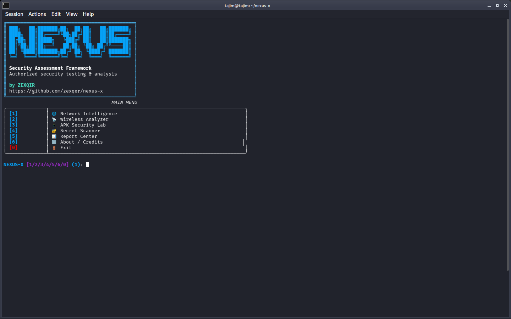

# NEXUS-X

### Security Assessment Framework

NEXUS-X is a modular, terminal-based security assessment framework designed for authorized security testing, defensive analysis, system visibility, and security auditing.

Built with Python 3 and a Rich-powered interactive terminal interface, NEXUS-X brings multiple defensive security assessment capabilities together inside a single structured framework. The project focuses on making security assessment workflows easier to organize, understand, automate, and report while maintaining a clear authorization-first approach.

NEXUS-X provides a unified command-line environment for network intelligence, wireless analysis, APK security analysis, secret detection, asset discovery, security auditing, finding correlation, dashboards, and report generation.

The framework is designed around a modular architecture, allowing individual security modules to operate independently while also sharing structured findings through the correlation and reporting layers.

## Core Capabilities

### Network Intelligence

Collect useful information about the local networking environment, including public IP information, network interfaces, active connections, listening services, routing information, DNS configuration, ARP/neighbor information, and complete network snapshots.

Results can be structured and exported for later analysis and reporting.

### Wireless Analyzer

Inspect available Wi-Fi interfaces and Bluetooth adapters and collect defensive inventory information. The wireless module is intended for visibility and authorized assessment only and does not implement wireless jamming, deauthentication, or denial-of-service functionality.

### APK Security Lab

Analyze Android APK files from a defensive and static-analysis perspective. The module can inspect application metadata, permissions, components, resources, DEX information, URLs, certificate metadata, and potentially exposed secrets without performing exploitative behavior.

### Secret Scanner

Search authorized files and project directories for potentially exposed credentials and sensitive configuration material such as API keys, tokens, passwords, cloud credentials, private keys, `.env` values, and configuration secrets.

Detected secrets are redacted in displayed and generated reports to reduce accidental exposure.

### Asset Discovery

Provide authorization-first asset discovery capabilities for approved environments. The module can assist with host discovery, DNS information, connectivity checks, service identification, and asset classification.

### Security Audit

Review security-relevant configuration and system posture, including exposed services, local configuration issues, file permissions, TLS/security-header observations, dependency information, Linux security posture, and common configuration mistakes.

### Correlation Engine

Connect assets, observations, and security findings into a structured view so that related issues can be analyzed together instead of being treated as isolated results.

### Security Dashboard

Present assessment information through a consistent terminal interface, making it easier to review discovered assets, findings, statistics, and assessment status from one location.

### Report Center

Generate structured security assessment output in formats such as JSON, CSV, HTML, and PDF-compatible report workflows.

Reports are organized by assessment category, including:

- Network
- Wireless
- APK
- Secrets
- Assets
- Audits

Sensitive values are redacted before being written to reports.

## Architecture

NEXUS-X follows a modular Python architecture where individual capabilities are separated into dedicated modules. This makes the framework easier to maintain, extend, test, and integrate with future security assessment components.

The project also includes configuration management, structured logging, plugin support, utility functions, reporting functionality, automated tests, and graceful handling of unavailable system utilities.

## Security Philosophy

NEXUS-X is designed for authorized security assessment and defensive research.

It intentionally avoids functionality for phishing, credential/session theft, camera or microphone hijacking, device-lock bypass, unauthorized password attacks, wireless jamming, deauthentication, malware deployment, persistence, stealth/evasion, destructive operations, data exfiltration, and unauthorized exploitation.

Use NEXUS-X only on systems, applications, networks, and devices where you have explicit permission to perform security assessment.

## Project Status

NEXUS-X is designed as an extensible security assessment foundation. Future development can extend the framework with additional web security auditing, dependency and vulnerability intelligence, cloud and container auditing, file-integrity monitoring, historical assessment databases, evidence graphs, advanced reporting, notifications, workspaces, trend analysis, SQLite-backed storage, scheduled authorized assessments, and a broader plugin ecosystem.

---

## Screenshot

### NEXUS-X Main Dashboard



The screenshot above demonstrates the interactive NEXUS-X terminal interface, including the project branding, security assessment framework identity, author attribution, GitHub project reference, and the central module navigation system.

## Framework Modules

| Module | Purpose |
|---|---|
| 🌐 Network Intelligence | Network visibility and system networking information |
| 📡 Wireless Analyzer | Wi-Fi and Bluetooth defensive inventory |
| 📦 APK Security Lab | Static Android APK security analysis |
| 🔐 Secret Scanner | Detection and redaction of exposed secrets |
| 🔎 Asset Discovery | Authorized asset and service discovery |
| 🛡️ Security Audit | Local and configuration security assessment |
| 🔗 Correlation Engine | Connect assets and security findings |
| 📊 Security Dashboard | Centralized assessment visibility |
| 📄 Report Center | Structured security reporting |
| 🔌 Plugin Manager | Extensible module architecture |
| ⚙️ Configuration | Centralized framework configuration |

The interface is intentionally designed around a clean terminal workflow so security practitioners can move between assessment modules without needing multiple unrelated tools or complicated command structures.

## Installation

### Requirements

- Python 3.10+
- Linux / Kali Linux / Debian-based distribution
- Git
- Recommended: virtual environment

### Clone Repository

```bash
git clone https://github.com/zexqir/nexus-x.git
cd nexus-x
chmod +x install.sh
./install.sh

---

## Credits

**NEXUS-X**

Created by **ZEXQIR**

GitHub: `github.com/zexqir/nexus-x`

Security Assessment Framework for authorized testing and defensive analysis.
